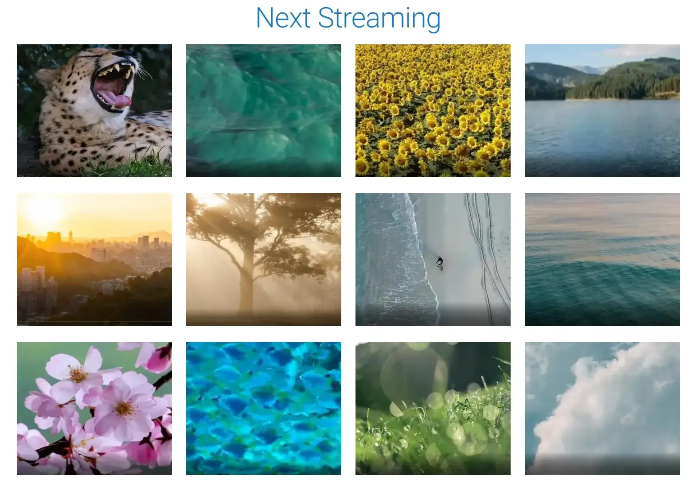

# video-streaming

Video Streaming is a Next.js and TypeScript microservices application that works with MongoDB to acquire video metadata. It then sends a direct message to the video storage microservice to retrieve the video from Azure Storage and stream it back to the client.

The application is currently a work in progress. The next steps will be to provision the infrastructure with Terraform, and then set up a Kubernetes cluster to manage the containers.

